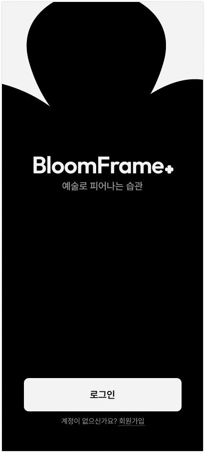
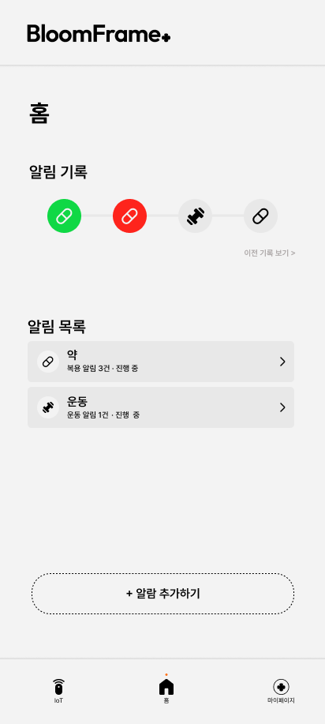
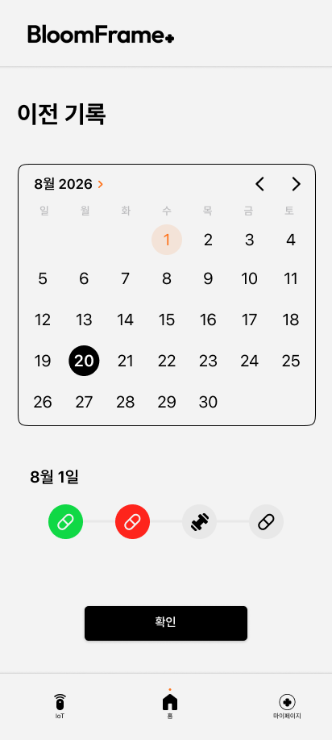
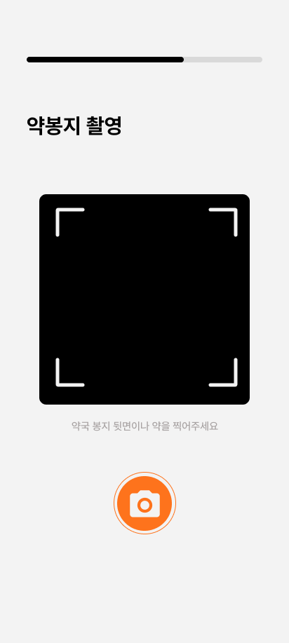
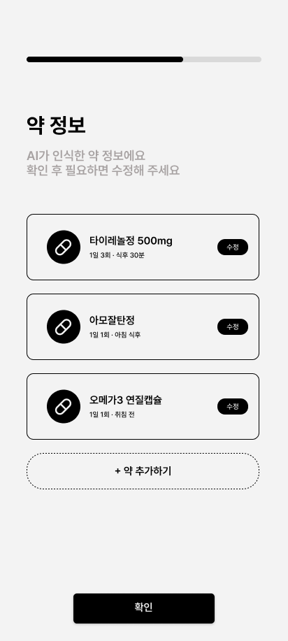
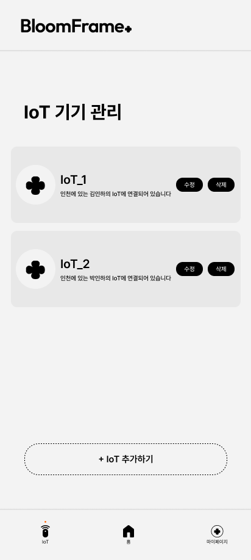
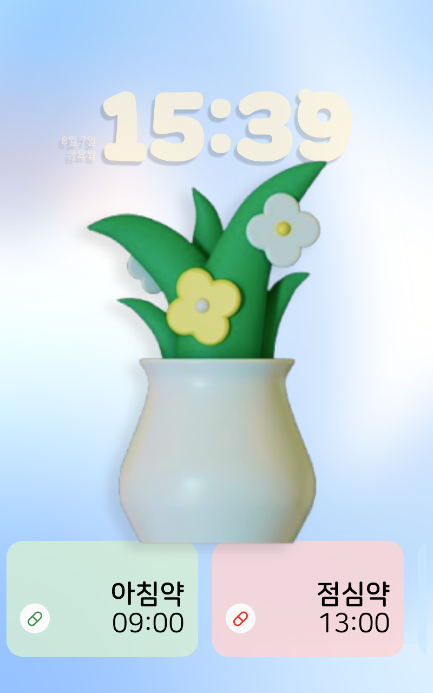
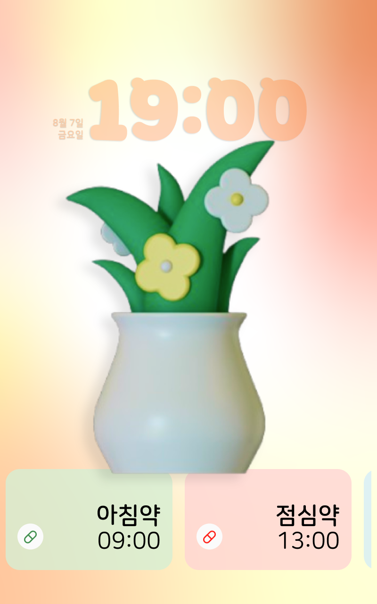
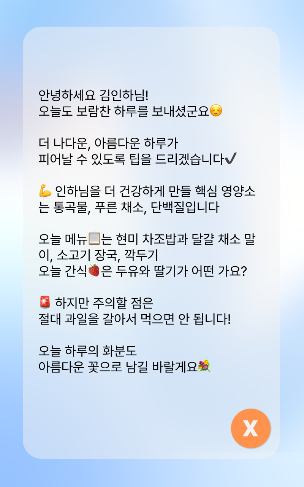

<div align="center">
  <picture>
    <source media="(prefers-color-scheme: dark)" srcset="src/assets/logo_white.webp" />
    
  </picture>

  <br />
  <br />

  **예술로 피어나는 습관**

  시니어의 복약과 일상 습관을 가족과 연결하고,<br />
  작은 실천을 디지털 액자 속 피어나는 꽃으로 보여주는 IoT 헬스케어 서비스

  <br />

  
  
  
  
</div>

---

## BloomFrame+ 소개

BloomFrame+는 약 복용, 운동, 사용자 지정 일정처럼 매일 반복되는 건강 습관을 관리하는 서비스입니다. 보호자는 모바일 웹에서 일정을 등록하고 이행 기록을 확인하며, 시니어는 연결된 IoT 디스플레이를 통해 다가오는 일정을 직관적으로 확인하고 터치로 수행을 인증할 수 있습니다.

알림을 제시간에 수행하면 시든 꽃이 다시 피어나는 시각적 피드백을 제공해, 건강 관리를 단순한 체크리스트가 아닌 지속 가능한 경험으로 만듭니다.

## 서비스 미리보기

### 모바일 앱

<table>
  <tr>
    <td align="center"></td>
    <td align="center"></td>
    <td align="center"></td>
  </tr>
  <tr>
    <td align="center"><strong>시작 화면</strong></td>
    <td align="center"><strong>오늘의 알람</strong></td>
    <td align="center"><strong>이전 기록</strong></td>
  </tr>
</table>

<table>
  <tr>
    <td align="center"></td>
    <td align="center"></td>
    <td align="center"></td>
  </tr>
  <tr>
    <td align="center"><strong>약봉지 AI 촬영</strong></td>
    <td align="center"><strong>약 정보 확인</strong></td>
    <td align="center"><strong>IoT 기기 관리</strong></td>
  </tr>
</table>

### IoT 디스플레이

<table>
  <tr>
    <td align="center"></td>
    <td align="center"></td>
    <td align="center"></td>
  </tr>
  <tr>
    <td align="center"><strong>평상시</strong></td>
    <td align="center"><strong>알람 임박</strong></td>
    <td align="center"><strong>맞춤 건강 정보</strong></td>
  </tr>
</table>

## 주요 기능

| 영역 | 기능 |
| --- | --- |
| 계정 | 회원가입, 로그인, 휴대폰 인증, 회원정보 조회·수정 |
| 건강 습관 | 복약·운동·기타 알람 등록, 수정, 삭제 및 중복 시간 방지 |
| 복약 관리 | 직접 입력, 약봉지 사진 AI 분석, 복용 횟수·시점 관리 |
| IoT 연결 | 기기 등록, 이름 변경, 연결·해제, 삭제 |
| IoT 디스플레이 | 실시간 알람 카드, 단계별 상태 변화, 터치 인증, 꽃 애니메이션 |
| 기록 | 오늘의 대기·성공·실패 상태와 날짜별 이전 기록 확인 |
| 마이페이지 | 약 목록 수정, 건강 상태 관리, 이용 안내 및 문의 |
| 동기화 | 서버 데이터 폴링, 인증 상태 동기화, 장애 시 기존 데이터 보호 |

## 서비스 흐름

```text
보호자 앱에서 일정 등록
        ↓
백엔드에 알람 및 적용 시작일 저장
        ↓
IoT 디스플레이에 오늘의 알람 카드 표시
        ↓
알람 시간에 화면 터치로 수행 인증
        ↓
백엔드 인증 기록 저장
        ↓
Home · 이전 기록 화면에 성공/실패 상태 반영
```

알람 상태는 다음 기준으로 표현합니다.

- `pending`: 아직 수행 여부가 결정되지 않은 알람
- `success`: IoT 터치 인증을 완료한 알람
- `missed`: 알람 시각부터 10분 안에 인증하지 않은 알람

현재보다 지난 시간을 등록하면 `startDate`를 다음 날로 지정하여, 등록 직후 당일 실패 상태가 되지 않도록 처리합니다.

## 기술 스택

### Frontend

- React 18
- React Router DOM 6
- Vite 5
- JavaScript
- Fetch API
- Context API 및 Local Storage
- Lucide React

### Deployment & Integration

- Vercel
- REST API
- JWT Bearer 인증
- Cloudflare Tunnel 기반 개발 서버 연동
- 다중 기기 상태 동기화를 위한 주기적 폴링

## 프로젝트 구조

```text
src/
├── api/                  # 인증·알람·약·IoT 기기 등 REST API 모듈
├── assets/               # 로고, 아이콘, 식물 및 IoT 애니메이션 리소스
├── components/
│   ├── common/           # 공통 레이아웃, 버튼, 입력창, 내비게이션
│   └── widgets/          # 시간 선택기, 이미지 선택 UI
├── constants/            # 카테고리 메타데이터
├── context/              # 앱 전역 상태 및 브라우저 저장소 동기화
├── pages/                # 라우트 단위 화면 컴포넌트
├── styles/               # 디자인 토큰 및 폰트
├── utils/                # 시간 변환, 알람 상태 및 기록 유틸리티
├── App.jsx               # 앱·IoT 라우팅
└── main.jsx              # React 진입점
```

## 시작하기

### 요구 사항

- Node.js 18 이상
- npm
- 실행 중인 BloomFrame+ 백엔드 서버

### 설치 및 실행

```bash
git clone https://github.com/EUNS0O/BloomFrame-FRONT-END.git
cd BloomFrame-FRONT-END
npm install
```

프로젝트 루트에 `.env.local` 파일을 만들고 백엔드 주소를 설정합니다.

```env
VITE_API_BASE_URL=https://your-backend.example.com
```

개발 서버를 실행합니다.

```bash
npm run dev
```

기본 접속 주소는 `http://localhost:5173`입니다.

### 같은 네트워크의 다른 기기에서 접속하기

```bash
npm run dev -- --host
```

휴대폰과 PC를 같은 네트워크에 연결한 뒤 `http://<PC의 IPv4 주소>:5173`으로 접속합니다. 백엔드 CORS에는 해당 Origin이 허용되어 있어야 합니다.

## 빌드

```bash
npm run build
npm run preview
```

빌드 결과물은 `dist/`에 생성됩니다.

## 주요 경로

| 경로 | 설명 |
| --- | --- |
| `/` | 시작 화면 |
| `/login` | 로그인 |
| `/signup/info` | 회원정보 입력 및 휴대폰 인증 |
| `/home` | 오늘의 알람 현황 |
| `/home/history` | 이전 기록 |
| `/home/alarms` | 전체 알람 관리 |
| `/mypage` | 마이페이지 |
| `/mypage/meds` | 등록된 약 목록 및 수정 |
| `/iot/manage` | IoT 기기 관리 |
| `/display/:deviceId` | IoT 디스플레이 |

## IoT 시연 모드

백엔드 상태와 관계없이 IoT 화면의 시각적 동작을 확인할 수 있는 테스트 파라미터를 제공합니다.

```text
/display/{deviceId}?testIn=5
```

5초 뒤 테스트 알람을 실행합니다.

```text
/display/{deviceId}?cardsTest=1
```

대기·성공·실패 상태의 카드를 한 화면에서 확인합니다. 테스트 모드는 실제 서버 인증 기록을 변경하지 않습니다.

## 배포

`main`은 최종 운영 배포, `develop`은 통합 테스트 및 Preview 배포에 사용합니다.

- Develop Preview: [BloomFrame+ develop](https://bloomframe-git-develop-jangeunsu9505-4566s-projects.vercel.app)
- Vercel의 Preview 및 Production 환경에 `VITE_API_BASE_URL`을 각각 설정해야 합니다.
- 백엔드 CORS에는 실제로 사용하는 Vercel Origin을 등록해야 합니다.
- SPA의 직접 경로 접근은 `vercel.json`의 rewrite 설정으로 처리합니다.

## 개발 시 유의사항

- API 기본 설정과 JWT 처리는 `src/api/client.js`에서 관리합니다.
- 알람의 상태 키는 다중 기기에서 동일하게 매핑되도록 서버 ID를 기준으로 생성합니다.
- 알람 목록 조회 일부가 실패하면 불완전한 결과로 기존 정상 데이터를 덮어쓰지 않습니다.
- 인증 기록은 화면이 활성화된 동안 짧은 간격으로 동기화합니다.
- `.env`와 `.env.local`은 저장소에 커밋하지 않습니다.

---

<div align="center">
  작은 실천이 매일의 꽃으로 피어나는 순간, <strong>BloomFrame+</strong>
</div>
